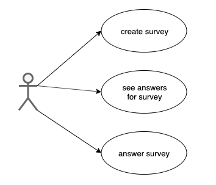
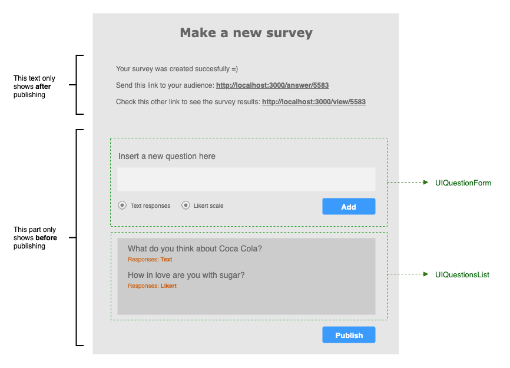
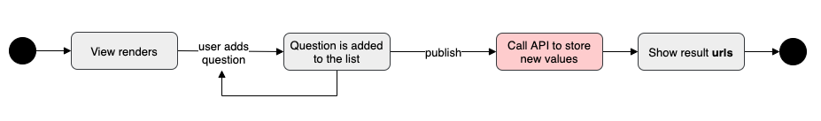

# Problem

Survey maker is being used by two types of users: *creator* (the one who creates the survey) and *respondent* (the one who fills it out). We can have many respondents for a single survey.

A creator should be able to create a simple form with one or more questions.

A response to a question can either be a text field (300 characters max) or a five-point Likert scale (i.e. strongly agree to strongly disagree).

The creator can then give a URL to one or more respondents who can then fill out the survey.

When these respondents have filled out the survey, they can optionally enter their email address, and then click submit. The responses are saved in the database.

The creator can then see the answers for each of their surveys in a React-based frontend interface.

No login/signup system is necessary.

# Solution proposal

We need to cover up for three use cases: the creation of the survey itself, the answering of it and the results checking.

Since no user login is required, we don't care about who is doing what. We just need to offer 3 ways to access the app:

1. User enters the app. As a default, the survey creation form is presented. When finished and saved, user will receive 2 *urls*, one to be sent to the potential respondents, and another that will show the current answers for the survey.

2. User visits the 'take the survey' url (which contains the survey id). She is presented with the survey questions to be answered. When form is sent, only a "thank you" message will be shown.

3. User visits the 'check survey results' url (which contains the survey id). Here a view of all the questions in the survey with the correspondent answers will be presented.

A black box model of the user's perspective of the I/O looks like this.

## Database

Given these data needs, we can model our database with three different objects.

Since we are not considering security, being the app so simple, we decide to use a flat file database.

## Architecture

We are setting up a *React App* to cope with the user interaction. This frontend app is gonna take care of routing as well.
For the three use cases we are setting up three routes and three components to deal with them.

Since the views are being handled by *React*, and no extra processing is needed, we are setting an *Express App* for the only purpose of being an API layer for the database.

# Functional specification: *React App*

We are setting up three **view components**: the one to handle the survey creation (SurveyCreate), the one to show the survey results (SurveyResults), and the one to handle the survey filling (SurveyAnswer).

## SurveyCreate

This component is instantiated for the route *"/"*.

A draft of the view's UI and the required subcomponents:

*SurveyCreate*'s state holds a **Survey** object linked to many **Question** objects. When *publish* button is clicked (only enabled after at least one question is added), the state is requested to be dumped into the database. Right afterwards, the user gets the two urls: one for the results, one for the survey to be sent for filling.

State must have:

- **survey** : Survey object
- **questions** : array of Question objects
- **published** : boolean to control if the survey was already published or not, so the correct parts of the view can be shown/hidden.
- **answerUrl** : generated url for the survey to be filled at.
- **resultsUrl** : generated url where to check the survey results.

Required methods besides *render()* are:

#### `addQuestion (text, type, ...likert)`

A new **question** is added to the *state*.

#### `publish ()`

A **POST** call to the API at */survey* is performed, providing the data contained in the *state*.

#### `showURLs ()`

As a callback for `publish()`, this function will set the *state* so that the generated urls and *published* flag are set.

## SurveyAnswer

This component is instantiated for the route *"/answer/:id"*.

A draft of the view's UI and the required subcomponent:

*SurveyAnswer*'s state holds the three objects: **Survey**, **Question** and **Answer**. Initially the info to initialize *Survey* and *Question* is retrieved from the database. When the survey is finished and sent, the data from *Question* is used to update the database, and the data from *Answer* is added to it.

State must have:

- **survey** : Survey object
- **questions** : array of Question objects
- **email** : string for user email, if used
- **sent** : boolean to control if the survey was already sent or not, so the correct parts of the view can be shown/hidden.

Required methods besides *render()* are:

#### `getSurvey (id)`

A **GET** call to the API at */questions* to load the survey data in the state.

#### `sendAnswers ()`

A **POST** call to the API at */answer* so that the user answers to the survey questions are stored in the database. 

#### `closeSurvey ()`

As a callback for `sendAnswers()`, this function will set the *state* so that the *sent* flag is set.

## SurveyResults

This component is instantiated for the route *"/results/:id"*.

A draft of the view's UI and the required subcomponents:

*SurveyResults* doesn't really need to maintain a state besides the survey data, since the user can change nothing within this view. The flow is pretty simple, the component makes a read request to the database and loads all the data into this nice presentation.

Required methods besides *render()* are:

#### `getSurveyResults (id)`

A **GET** call to the API at */answers* to load the survey data.

# Functional specification: *Express App*

The backend part of this tool doesn't need to take care of complex stuff, since the rendering of the views is fully handled by *React*. It's only purpose is to serve as an API to properly operate the database.

## Endpoints

We just decided to use four different endpoints with unique request methods.

#### `/survey`

**Method**: POST

**Input**: A set of *Question* objects

**Database**: New questions are appended to *questions* file. A new survey is appended to *surveys* file with a new id and references to the ids of all the linked questions.

**Output**: None.

#### `/questions`

**Method**: GET

**Input**: The id of the survey which questions want to be retrieved.

**Database**: The survey with the corresponding id is retrieved from *surveys*. Then the questions with the ids given by the survey data are retrieved.

**Output**: Array of questions.

#### `/answer`

**Method**: POST

**Input**: An array of pairs [question id, {answer}].

**Database**: For each pair: a new answer is appended to *answers* file. The question with the corresponding id is edited at file *questions* to include this new answer id.

**Output**: None.

#### `/answers`

**Method**: GET

**Input**: A survey id.

**Database**: *surveys* file is read to extract the array of questions id. The *questions* file is read to retrieve the matching questions. For each question, for each answer id included in that question, retrieve the answer data from *answers* file.

**Output**: All the questions and answers data in the survey.